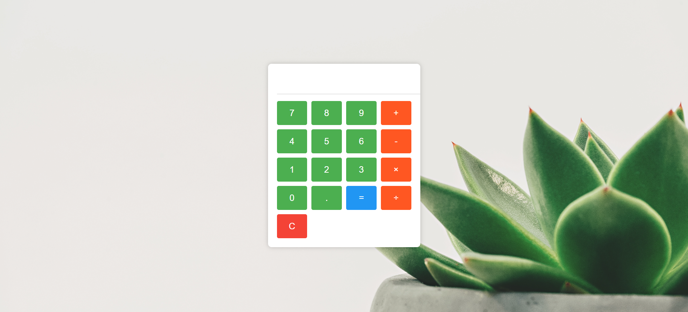

# Calculator Web Application

The Calculator Web Application is a simple and user-friendly calculator built using Node.js and JavaScript. It allows users to perform basic arithmetic operations, such as addition, subtraction, multiplication, and division, within a web browser.

## Table of Contents

- [Features](#features)
- [Demo](#demo)
- [Getting Started](#getting-started)
  - [Prerequisites](#prerequisites)
  - [Installation](#installation)
- [Usage](#usage)
- [Contributing](#contributing)
- [License](#license)

## Features

- **Basic Arithmetic:** Perform addition, subtraction, multiplication, and division operations.
- **Real-Time Calculation:** See results as you input numbers and operators.
- **Clear Functionality:** Reset the input with a single click.

## Demo

You can try out the Calculator Web Application live at [Demo Link](https://calculator-using-node-js-nn8o.vercel.app/).
